<p align="center">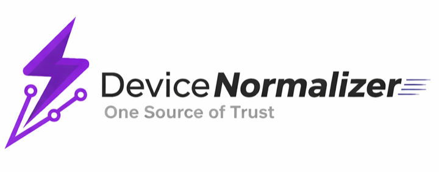</p>

# Device Normalizer

<!-- README-I18N:START -->

**English** | [Español](./README.es.md)

<!-- README-I18N:END -->

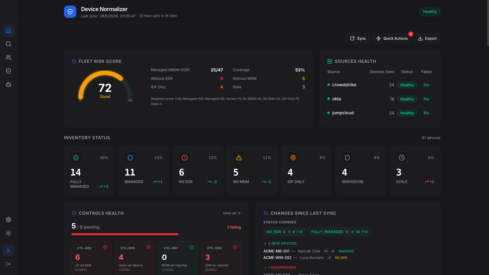

> A device-coverage security dashboard. Correlates **EDR + MDM + IDP** sources
> into a single normalized inventory, surfaces coverage gaps, and scores
> overall fleet posture.

**Demo build · runs entirely on synthetic mock data, no backend.**

---

## Why this exists

In most orgs, devices are tracked by three independent systems:

| Layer | Typical tool | Knows about |
|---|---|---|
| **EDR** — endpoint detection | CrowdStrike | every host the sensor sees |
| **MDM** — device management | JumpCloud | every device IT enrolled |
| **IDP** — identity | Okta | every device that touched login |

Each has its own inventory. The overlap is partial, and the **gaps are where risk lives**:

- A laptop in MDM but missing the EDR agent.
- A device with EDR running but never enrolled in MDM.
- A user with Okta sessions and no managed device (likely BYOD / shadow IT).
- A managed device that stopped reporting 90+ days ago.

Device Normalizer correlates devices across the three sources, deduplicates them,
classifies each into a coverage status (`FULLY_MANAGED`, `NO_EDR`, `NO_MDM`,
`IDP_ONLY`, `SERVER`, `STALE`, …) and exposes the gaps on a single dashboard.

## What's in the demo

- **Dashboard (bento)** — risk-score gauge, 7-status KPI band, controls health,
  sync diff, distribution charts (status / source / region / OS), time-series
  trend, device inventory, low-confidence list.
- **People** — per-owner compliance with drill-down to that person's devices.
- **Dual-use** — users with both corporate and personal devices; acknowledge flow.
- **Controls** — KRI / CIS-tagged checks (MDM-without-EDR, per-source agent
  dormancy, zombie devices, …) with affected-device lists.
- **Search** — filter the normalized inventory by status, source, region.
- **Settings** — sync interval, source configuration health, recent sync runs.
- **AI assistant** — scoped Q&A panel (canned replies in the demo).

All numbers, hostnames, owners and organizations are **fabricated**.

## How it works

### Architecture

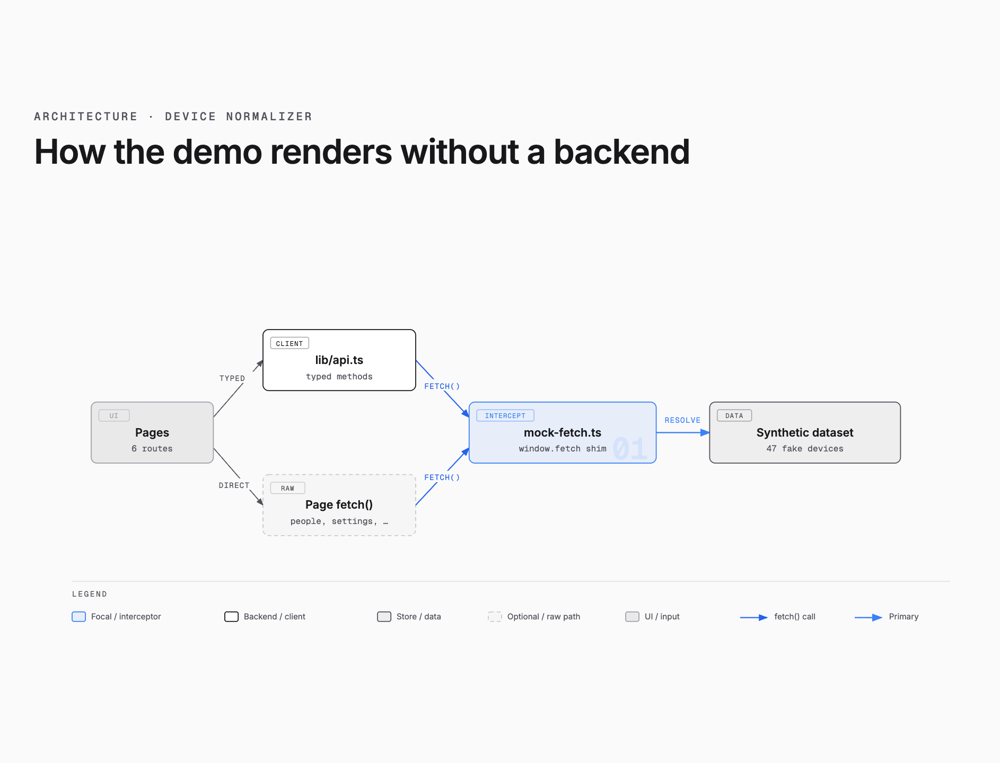

`src/lib/mock-fetch.ts` shims `window.fetch` so both `lib/api.ts` and raw
`fetch()` calls in secondary pages get intercepted. Every view renders
without a backend. [Open diagram →](docs/diagrams/architecture.html)

### Source correlation

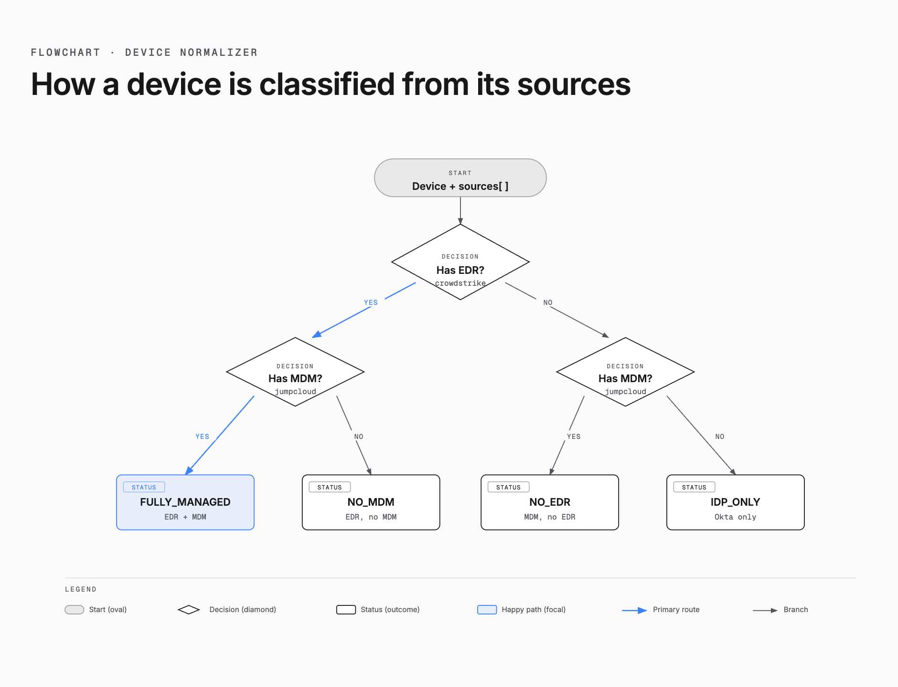

How a device gets classified from its sources — `Has EDR? → Has MDM?`
cascades into the canonical statuses (`FULLY_MANAGED`, `NO_EDR`, …).
[Open diagram →](docs/diagrams/source-correlation.html)

### Sync lifecycle

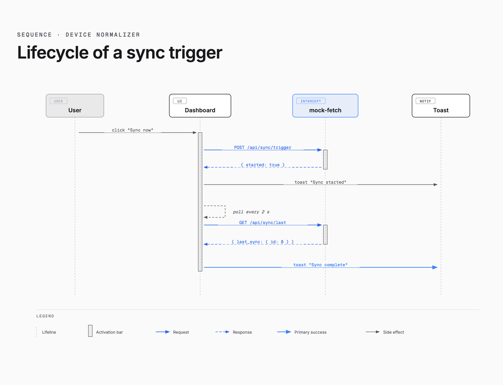

A sync trigger fires `POST /api/sync/trigger`, then the UI polls
`/api/sync/last` every 2 s until a fresh run ID appears, and finishes
with a toast. [Open diagram →](docs/diagrams/sync-sequence.html)

### Data model

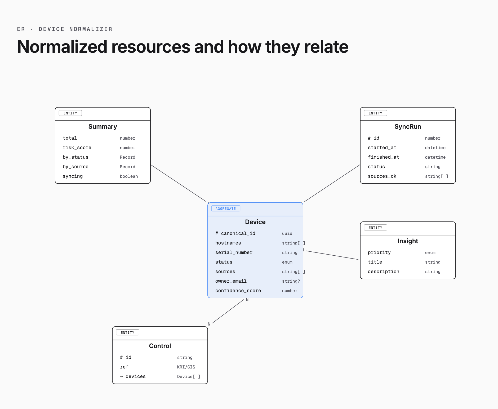

The shape of the normalized resources — `Device` as the aggregate root,
with `Summary`, `SyncRun`, `Insight` and `Control` related around it.
[Open diagram →](docs/diagrams/data-model.html)

## Stack

| Layer | Choice | Why |
|---|---|---|
| Framework | React 19 + TypeScript | type safety, modern hooks |
| Build | Vite | fast dev, simple static output |
| Styles | Tailwind CSS v4 | utility-first, OKLCH-friendly tokens |
| Charts | Recharts | composable, accessible SVG charts |
| Motion | Motion (framer-motion successor) | declarative, respects reduced-motion |
| Icons | lucide-react | one icon set, consistent stroke |
| Mock data | `window.fetch` interceptor | no MSW dep, pure runtime, deterministic |

## Run

```bash
npm install
npm run dev      # http://localhost:5173
npm run build    # production build → dist/
npm run preview  # serve the production build
```

## Deploy

Build is fully static — drop `dist/` on any static host (Vercel, Netlify,
GitHub Pages, Cloudflare Pages).

```bash
npm run build
# upload dist/  →  done
```

## Design notes

- **Bento layout** with explicit hierarchy (risk + sources hero, KPI band,
  paired operational panels, full-width tables) — replaces the
  "everything-is-a-card" stack that the redesign started from.
- **Single accent** (no rainbow nav icons), tabular numerics, lightness-based
  card elevation, solid logo tile.
- `prefers-reduced-motion` honored: CSS animations collapse, framer-motion
  reveals soften.
- Light / dark theme with persistent toggle.
- Mixed Spanish / English copy in some surfaces — preserved from the original.

## Screenshots

<table>
  <tr>
    <td width="50%"><a href="docs/screenshots/controls.png">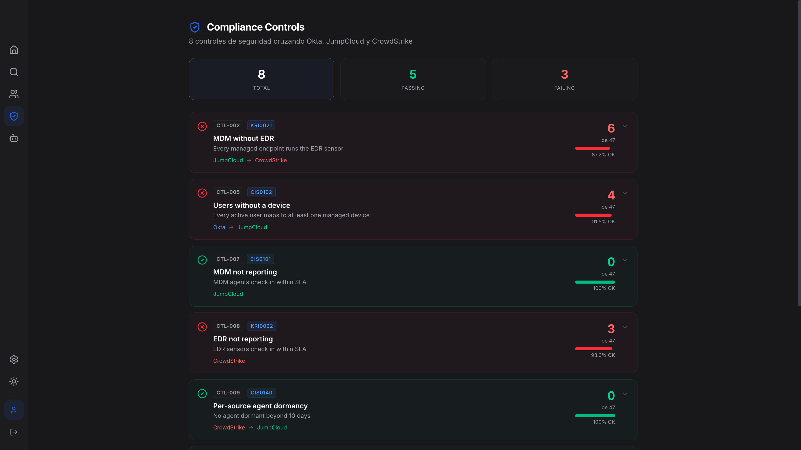</a><br><sub><b>Controls</b> — KRI/CIS-tagged checks across Okta, JumpCloud, CrowdStrike.</sub></td>
    <td width="50%"><a href="docs/screenshots/people.png">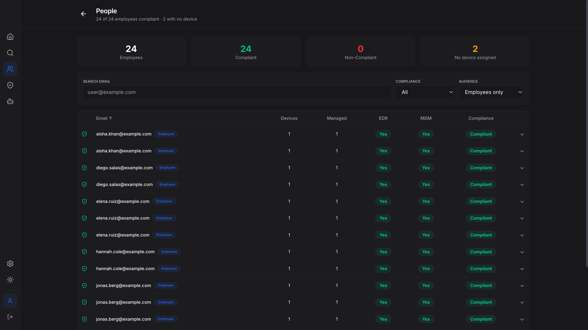</a><br><sub><b>People</b> — per-owner compliance with drill-down.</sub></td>
  </tr>
  <tr>
    <td><a href="docs/screenshots/dual-use.png">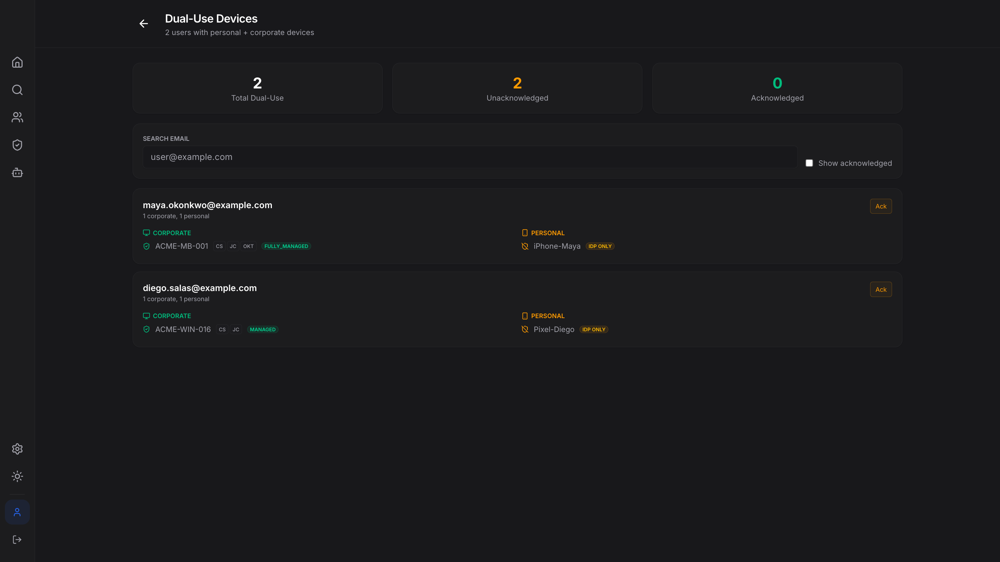</a><br><sub><b>Dual-use</b> — corporate vs personal devices, with ack flow.</sub></td>
    <td><a href="docs/screenshots/search.png">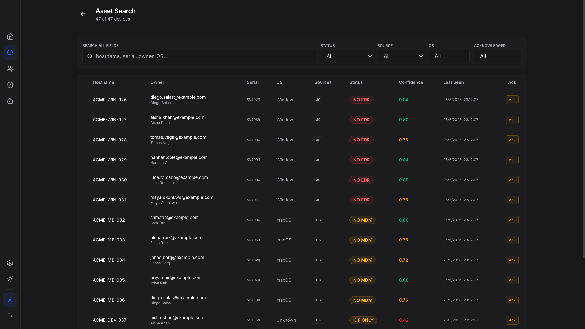</a><br><sub><b>Asset search</b> — filter the normalized inventory.</sub></td>
  </tr>
  <tr>
    <td><a href="docs/screenshots/settings.png">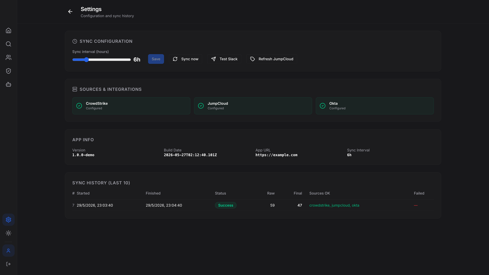</a><br><sub><b>Settings</b> — sync interval, source health, recent runs.</sub></td>
    <td><a href="docs/screenshots/ai-assistant.png"></a><br><sub><b>AI assistant</b> — scoped Q&A panel (canned demo).</sub></td>
  </tr>
</table>

## Known demo limitations

- `/auth/logout` link 404s in static hosting (no backend) — purely cosmetic.
- AI assistant replies are canned keyword matches, not an actual LLM call.
- One transitive npm vulnerability (moderate) — see `npm audit`.
